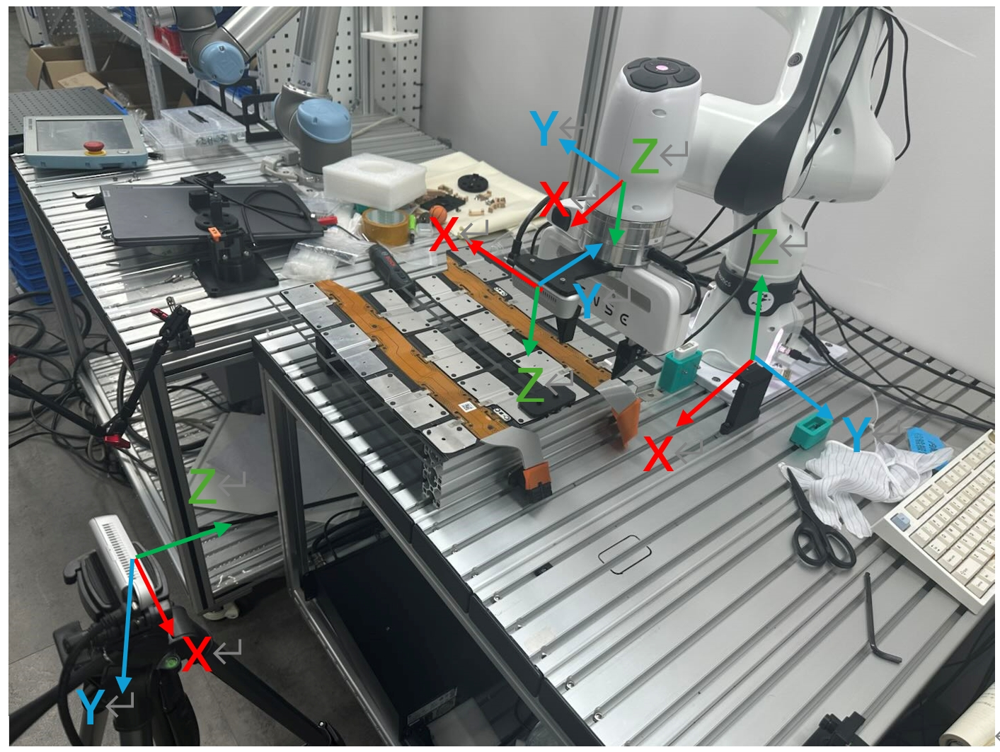
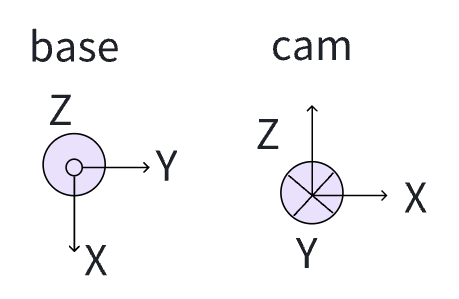
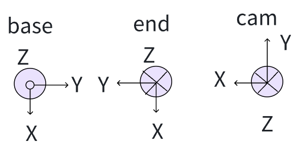

# 使用

修改xarm_init和 get_pos函数，获取机械臂当前xyzrpy值

# 验证
所有的讨论,都是基于机械臂基座坐标系的
## 1. 眼在手外验证方法

  

绘制当前的相机坐标系和基座坐标系，当前为:

  

1. 获取基座坐标系,cam姿态
当前状态下，是[-z,x,-y]  
2. 求解R_cam_to_base
R_cam_to_base*cam = base,即RT * [x,y,z]   = [-z,x,-y] ,故RT = [[0,0,-1],[1,0,0],[0,-1,0]]
3. 求解T_cam_to_base
R*cam+T = base, 所以R*cam已经在base坐标系了,故按照base坐标系,把cam转换到base
# TODO
需要从机械臂坐标系出发，x+932,y+50,z+191  

## 2. 眼在手上验证方法
1. 获取基座坐标系下,end姿态
在任意姿态，通过get_pos获取当前的机械臂末端矩阵，如当前姿态下，RT_end_to_base = [[1,0,0],[0,1,0],[0,0,1]]，  
end =RT_end_to_base*[x,y,z] = [x,y,z]
2. 获取基座坐标系下,cam姿态
* 看基座坐标系的X方向,cam是-y  
相对于基座,cam姿态是 [-y,-x,-z]  
3. 获取R_cam_to_end
end = RT*cam
 RT * [x,y,z]=[-y,-x,-z] ,RT =  [[0,-1,0],[-1,0,0],[0,0,-1]]
4. 求解T_cam_to_end
需要从末端坐标系出发，x+80,y+,z+191  

  

